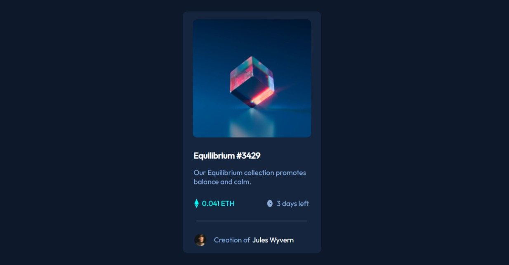

# Frontend Mentor - NFT preview card component solution

This is a solution to the [NFT preview card component challenge on Frontend Mentor](https://www.frontendmentor.io/challenges/nft-preview-card-component-SbdUL_w0U). Frontend Mentor challenges help you improve your coding skills by building realistic projects. 

## Table of contents

- [Overview](#overview)
  - [Screenshot](#screenshot)
  - [Links](#links)
- [My process](#my-process)
  - [Built with](#built-with)
  - [What I learned](#what-i-learned)
  - [Continued development](#continued-development)
  - [Useful resources](#useful-resources)
- [Author](#author)
- [Acknowledgments](#acknowledgments)

## Overview
A very nice challenge that has taught me more real world use cases of fexbox, svg and pseudo classes. For the first time I've made sure to add overlay without any javascript and I love it. The challenge was good to grasp the concepts of css.

### Screenshot

### Links

- Solution URL: [Add solution URL here](https://your-solution-url.com)
- Live Site URL: [Add live site URL here](https://jikkeee.github.io/nftcard/)

## My process
I started with visualizing the challenge and a little bit thinking on how to get it done, got my hands dirty real quick because to find solution one must do, the HTML was quite simple, then the css challenging as ever but it was cool I had a bit of help from stack overflow
### Built with

- Semantic HTML5 markup
- CSS custom properties
- Flexbox
- Mobile-first workflow

### What I learned
I learnt more about styling SVG, and triggered overlay effects

### Continued development
I will continue to learn more in depth css, and finish up grid and masking

### Useful resources

- [Dcode Youtube Channel](https://www.youtube.com/c/dcode-software) -This helped on hover effect using only CSS
- [Stack Overflow](https://www.stackoverflow.com) - This helped me with styling svg.

## Author

- Frontend Mentor - [@jikkeee](https://www.frontendmentor.io/profile/jikkeee)
- Twitter - [@yourusername](https://www.twitter.com/jikkeee)

## Acknowledgments

Thanks to fontawesome for the icons and @decodeyt(twitter) for his help.

